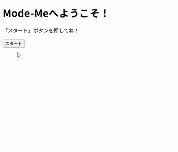

# メタ認知トレーニングゲーム (Webアプリ)

SSのアウトプット学習として作成した、 
Web上で動くメタ認知トレーニングゲームです。 

[概要](#概要)｜
[できる事](#できる事)｜
[使用環境と技術](#使用環境と技術)｜
[実行イメージ](#実行イメージ)｜
[工夫した点](#工夫した点)｜
[苦労や学び](#苦労や学び)｜
[その他](#その他)｜
[進捗](#進捗)｜
[制作物](#制作物)
 

## 概要 
・SS学習開始約3か月後にEclipseで作成したプログラムです。 
　（SS学習：2025年10月16日～　制作期間：2026年2月2日～） 
・メタ認知トレーニングを目的として作成した、 
　Web上で動作するゲームです。 
・Java（servlet、model）とJSPを中心に実装しております。 
　（HTML＆CSS学習 ：2025年8月12日～9月10日 
 　 JavaScript学習：2025年11月17日～12月9日） 
　　　> [▲ トップへ戻る](#top)

## できる事 
ver1.0.0 
1. ランダムで問題出題 
1. 判定＆コメント表示 
　> [▲ トップへ戻る](#top)

## 使用環境と技術 
・言語等：Java（servlet、model）、JSP 
・実行環境：Web 
・使用技術： 
　フォーム送信による値の受け渡し・取得 
　Math.randomによる乱数生成 
　画面表示制御 
　データベース接続・SQL文作成・実行 
　　　> [▲ トップへ戻る](#top)

## 実行イメージ 
ver1.0.0 
 
　　　> [▲ トップへ戻る](#top)
 
## 工夫した点 
ver1.0.0 
・解答ボタン押した時、結果画面だけでなく次の問題も表示・選択できることでスピード感アップ！ 
　瞬発力を鍛えるものなので、スピードが速くなったのはとても良かったか思っています。 
　　　> [▲ トップへ戻る](#top)

## 苦労や学び 
ver1.0.0 
・メモアプリ制作でDAO記述について処理の手順等は理解が深まっていたが、 
　何も見ないで打つことはできませんでした。身についていないことを痛感しました。 
・コントローラ・モデル・ビューや、クラス・メソッドをきちんと役割で分けて、 
　作成することを意識しました。 
　前回制作したメモアプリよりは、かなり見やすくなり無駄なものが少なくなったと感じました。 
　（今回は機能がまだ少ない分、そう感じたのかもしれませんが） 
・また機能を増やしていく予定です！
　　　> [▲ トップへ戻る](#top)

## その他 
・実行する自分をメインメソッド、客観的に見る自分をメソッドとして呼び出すイメージをひらめきました！ 
　どの自分を呼び出すかで、自分の中での感じ取り方が変わることに気づいたので、 
　適した自分を選択して生きやすくなるために、このゲームを作ろうと考えました！ 
　判断を早くすることで、無意識に思い出せるようにスピード感重視で！ 
　かつ、長く続けられ定期的にチェックできるようなものにしたいと考えました。 
　　　> [▲ トップへ戻る](#top)

## 進捗 
ver1.0.0 
・2026年2月2日　設計、画面遷移・問題＆解答実装 
・2026年2月3日　ランダム値(ID)よりSQL文(SELECT)作成・実行、正答判定、表示 

　　　> [▲ トップへ戻る](#top)

## 制作物 
　【 コマンドプロンプトで実行 】 
・じゃんけんゲーム：[janken-java](https://github.com/kita-izu-13/janken-java) 

　【 Webアプリで実行 】 
・じゃんけんゲーム：[janken-ss](https://github.com/kita-izu-13/janken-ss) 
・掲示板アプリ：[bbs-ss](https://github.com/kita-izu-13/bbs-ss) 
・メモアプリ：[memo-ss](https://github.com/kita-izu-13/memo-ss) 

　【 Androidアプリで実行 】 
・じゃんけんゲーム：[janken-android](https://github.com/kita-izu-13/janken-android) 
　　　> [▲ トップへ戻る](#top)
