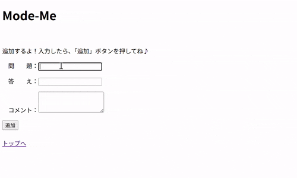
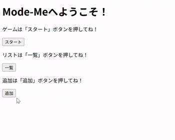
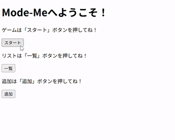
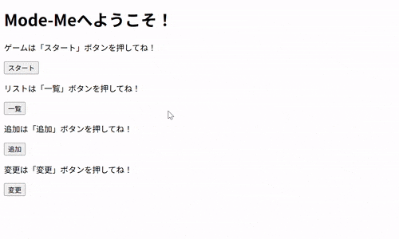
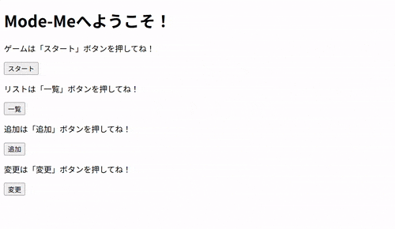
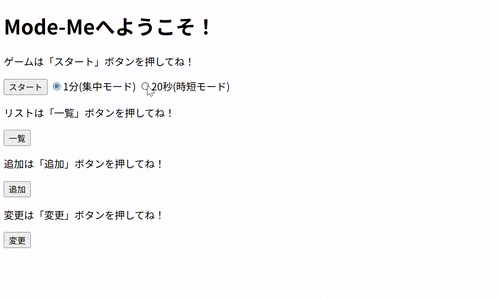
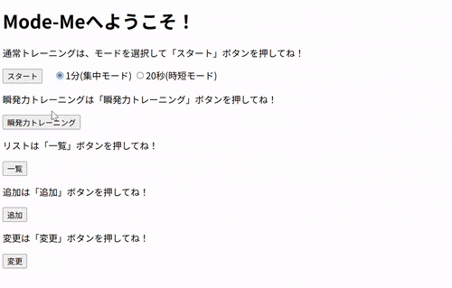
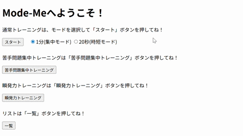

# メタ認知トレーニングゲーム (Webアプリ)

SSのアウトプット学習として作成した、 
Web上で動くメタ認知トレーニングゲームです。 

[概要](#概要)｜
[できる事](#できる事)｜
[使用環境と技術](#使用環境と技術)｜
[実行イメージ](#実行イメージ)｜
[工夫した点](#工夫した点)｜
[苦労や学び](#苦労や学び)｜
[その他](#その他)｜
[進捗](#進捗)｜
[制作物](#制作物)
 

## 概要 
・SS学習開始約3か月半後にEclipseで作成したプログラムです。 
　（SS学習：2025年10月16日～　制作期間：2026年2月2日～2月18日） 
・メタ認知トレーニングを目的として作成した、 
　Web上で動作するゲームです。 
・Java（servlet、model）とJSPを中心に実装しております。 
　（HTML＆CSS学習 ：2025年8月12日～9月10日 
 　 JavaScript学習：2025年11月17日～12月9日） 
　　　> [▲ トップへ戻る](#top)

## できる事 
ver1 
・ランダムで問題出題 
・判定＆コメント表示 

ver2 
・一覧表示 
・問題＆コメント＆答えの追加 
・1分経ったら終了＆ランク表示 

ver3 
・不正解の場合、背景が薄オレンジに変化 
・問題＆答え＆コメントの変更 
・トレーニング時間選択　集中モード：１分　時短モード：20秒 
・苦手問題集中トレーニング 
・瞬発力トレーニング　１問制限時間：2秒 

　> [▲ トップへ戻る](#top)

## 使用環境と技術 
・言語等：Java（servlet、model）、JSP 
・実行環境：Web 
・使用技術： 
　フォーム送信による値の受け渡し・取得 
　Math.randomによる乱数生成 
　画面表示制御 
　データベース接続・SQL文作成・実行 
　終了時間到達による画面遷移 
　　　> [▲ トップへ戻る](#top)

## 実行イメージ 
● ver1 
 
● ver2 
・追加＆一覧表示 
 
・Ｓランク 
 
・Ａランク 
 
・Ｂランク 
 
　※イメージ用で制限時間6秒、Ｓランク５問以上正解、Ａランク４問以上正解、Ｂランク４問未満正解にしてます。 
　　実際は、この10倍です。（制限時間60秒。Ｓランク50問以上正解、Ａランク40問以上正解、Ｂランク40問未満正解） 
● ver3 
・不正解時、背景変更 
 
・変更＆一覧表示 
 
・Ｓランク（時短モード） 
 
　※制限時間20秒。Ｓランク15問以上正解、Ａランク12問以上正解、Ｂランク12問未満正解 
・Ｓランク（瞬発力トレーニング） 
 
　※1問の制限時間2秒。Ｓランク5問以上正解、Ａランク3問以上正解、Ｂランク3問未満正解 
・苦手問題集中トレーニング 
 
　※制限時間なし。新規追加10回よりスタート正解したら-1、不正解で+1。1以上の場合、対象 

　　　> [▲ トップへ戻る](#top)
 
## 工夫した点 
ver1 
・解答ボタン押した時、結果画面だけでなく次の問題も表示・選択できることでスピード感アップ！ 
　瞬発力を鍛えるものなので、スピードが速くなったのはとても良かったかと思っています。 
ver2 
・問題＆答え＆コメントを追加機能をつけ、トレーニング！ 
　頭の中を整理する機会づくりにもピッタリ♪ 
・選択肢の４つは【時間軸（過去、将来）×行動軸（ブレーキ、アクセル）】という意味付けがあります。 
　そのため、これ以上選択肢を増やさなくても、シンプルに選択できると考えています。 
ver3 
・瞬発力トレーニングは、不正解問わず、とにかく素早く答えることを重視したモードです。 
　はじめは制限時間1秒にしていたのですが、答える時間もなくすぐ終わってしまうため、2秒に変更しました。 
　それでも少し考えこむとすぐ終わってしまうので、瞬時に判断する必要があり、トレーニングにバッチリです！ 
・苦手問題集中トレーニングは、正解率が低いものを対象に問題が出題されるモードです。 
　苦手問題を集中的にトレーニングすることで、まずは頭で考えて判断できるようにします。 
　そのため、時間制限は設けていません。 
　　　> [▲ トップへ戻る](#top)

## 苦労や学び 
ver1 
・メモアプリ制作でDAO記述について処理の手順等は理解が深まっていたが、 
　何も見ないで打つことはできませんでした。身についていないことを痛感しました。 
・コントローラ・モデル・ビューや、クラス・メソッドをきちんと役割で分けて、 
　作成することを意識しました。 
　前回制作したメモアプリよりは、かなり見やすくなり無駄なものが少なくなったと感じました。 
　（今回は機能がまだ少ない分、そう感じたのかもしれませんが） 
・また機能を増やしていく予定です！ 
ver2 
・１分経過後に画面を変える処理が難しかったです。 
　スタートボタン押してから現在時間取得・終了時間設定→セッションスコープへ 
　JavaScriptで１秒ごとに現在時間をチェックし、終了時刻になるとサーブレットへ 
　ランク判定してセッションスコープへ→ランク結果画面を表示 
　調べて試行錯誤してようやくできました。 
ver3 
・「苦手問題克服集中モード」をどのように実装するか悩みました。 
　「新規追加して10回からスタート・正解したら-1、不正解で+1。1以上の場合、対象」とし、 
 　そのため、テーブルの項目を追加することにしました。 
　　　> [▲ トップへ戻る](#top)

## その他 
・実行する自分をメインメソッド、客観的に見る自分をメソッドとして呼び出すイメージをひらめきました！ 
　（実体化している自分をインスタンスとなるが、もう実体化しているので省略） 
　どの自分を呼び出すかで、自分の中での感じ取り方が変わることに気づいたので、 
　適した自分を選択して生きやすくなるために、このゲームを作ろうと考えました！ 
　判断を早くすることで、無意識に思い出せるようにスピード感重視で！ 
　かつ、長く続けられ定期的にチェックできるようなものにしたいと考えました。 
　　　> [▲ トップへ戻る](#top)

## 進捗 
ver1 
・2026年2月2日　設計、画面遷移・問題＆解答実装 
・2026年2月3日　ランダム値(ID)よりSQL文(SELECT)作成・実行、正答判定、表示 
ver2 
・2026年2月3日　LogicとDAOにlistメソッド追加、JSP新規作成・一覧表示 
・2026年2月4日　LogicとDAOにinsertメソッド追加、テーブルに追加。JSPフォーム追加 
・2026年2月5日　現在時刻と数秒後の表示（試作） 
・2026年2月6日　JavaScriptで現在時刻を取得し、表示（1秒ごと） 
・2026年2月7日　特定回数終了後ランク判定（試作）、１分後強制終了→ランク結果画面へ 
ver3 
・2026年2月8日　「不正解！」の場合、背景色を変更 
・2026年2月10日　JSP追加（ラジオボタン）。LogicとDAOにupdateメソッド追加、idによりテーブルから取得。 
・2026年2月11日　JSPフォーム追加（選択した内容）。LogicとDAOにupdateformメソッド追加、idによりテーブル内容変更。 
・2026年2月13日　トップ画面に集中モードと時短モードを実装（ラジオボタンで追加。Logicにrankshortメソッド追加。） 
　　　　　　　　　瞬発力トレーニング実装。（ボタン追加。LogicにranksExメソッド追加。） 
・2026年2月16日　問題集中トレーニング実装。（ボタン追加。JSP追加。） 
・2026年2月17日　問題集中トレーニング実装。（LogicとDAOにmissupdate追加。） 
・2026年2月18日　仕上げ 

　　　> [▲ トップへ戻る](#top)

## 制作物 
　【 コマンドプロンプトで実行 】 
・じゃんけんゲーム：[janken-java](https://github.com/kita-izu-13/janken-java) 

　【 Webアプリで実行 】 
・じゃんけんゲーム：[janken-ss](https://github.com/kita-izu-13/janken-ss) 
・掲示板アプリ：[bbs-ss](https://github.com/kita-izu-13/bbs-ss) 
・メモアプリ：[memo-ss](https://github.com/kita-izu-13/memo-ss) 
・メタ認知トレーニングゲーム：[memo-ss](https://github.com/kita-izu-13/mode-ss) 

　【 Androidアプリで実行 】 
・じゃんけんゲーム：[janken-android](https://github.com/kita-izu-13/janken-android) 
　　　> [▲ トップへ戻る](#top)
